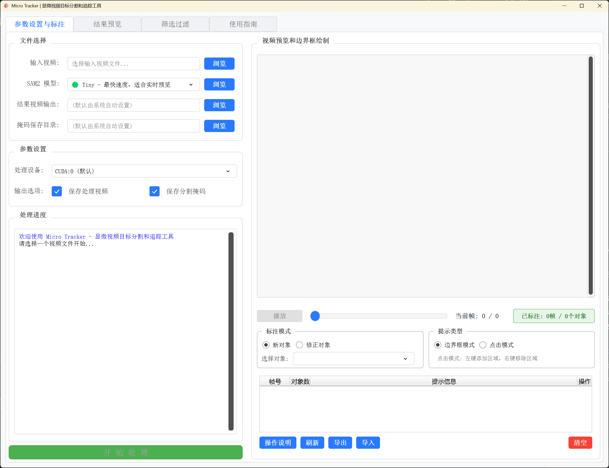
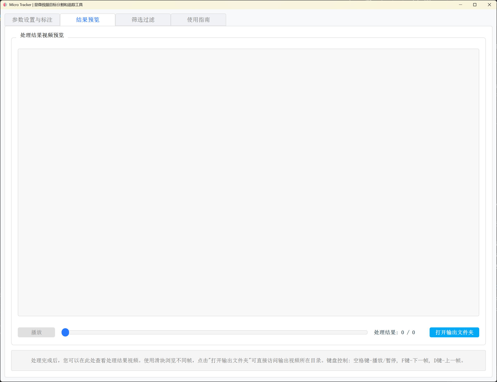
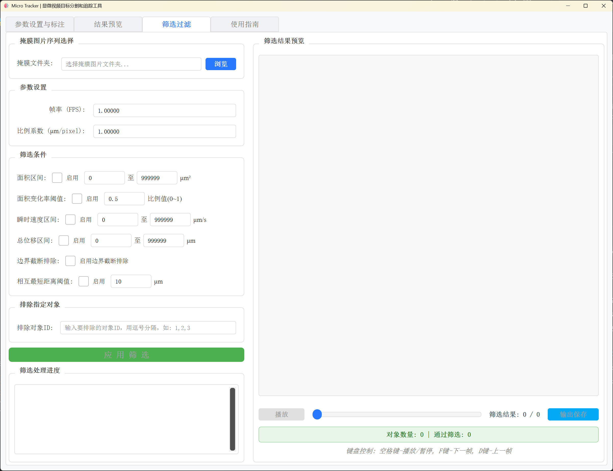

<div align="center">

```
 ███╗   ███╗██╗ ██████╗██████╗  ██████╗     ████████╗██████╗  █████╗  ██████╗██╗  ██╗███████╗██████╗
 ████╗ ████║██║██╔════╝██╔══██╗██╔═══██╗    ╚══██╔══╝██╔══██╗██╔══██╗██╔════╝██║ ██╔╝██╔════╝██╔══██╗
 ██╔████╔██║██║██║     ██████╔╝██║   ██║       ██║   ██████╔╝███████║██║     █████╔╝ █████╗  ██████╔╝
 ██║╚██╔╝██║██║██║     ██╔══██╗██║   ██║       ██║   ██╔══██╗██╔══██║██║     ██╔═██╗ ██╔══╝  ██╔══██╗
 ██║ ╚═╝ ██║██║╚██████╗██║  ██║╚██████╔╝       ██║   ██║  ██║██║  ██║╚██████╗██║  ██╗███████╗██║  ██║
 ╚═╝     ╚═╝╚═╝ ╚═════╝╚═╝  ╚═╝ ╚═════╝        ╚═╝   ╚═╝  ╚═╝╚═╝  ╚═╝ ╚═════╝╚═╝  ╚═╝╚══════╝╚═╝  ╚═╝
```

<h3><em>基于SAM2的显微视频目标分割和追踪工具</em></h3>
<h4>SAM2-based Microscopy Video Object Segmentation and Tracking Tool</h4>

</div>

<p align="center">
  
  
  
  
  
  <!-- More badges as needed -->
</p>

<div align="center">
  <a href="#english-version">English</a> | <a href="#chinese-version">中文</a>
</div>

---

<a id="english-version"></a>

# 🔬 Micro_Tracker [English]

Micro_Tracker is a microscopy image/video analysis tool based on the SAM2 model, designed specifically for tracking and analyzing microscopic organisms and particles. The application provides an intuitive user interface that allows researchers to easily mark, track, and analyze objects under a microscope.

## 🖥️ Application Interface

<div align="center">
  <table>
    <tr>
      <td align="center" width="33%">
        <br/>
        <strong>🎯 Video Annotation</strong><br/>
        <em>Interactive object marking and tracking setup</em>
      </td>
      <td align="center" width="33%">
        <br/>
        <strong>📊 Result Preview</strong><br/>
        <em>Preview the tracking result video</em>
      </td>
      <td align="center" width="33%">
        <br/>
        <strong>🔍 Advanced Filtering</strong><br/>
        <em>Sophisticated data analysis and export</em>
      </td>
    </tr>
  </table>
</div>

> 💡 **Note**: Screenshots show the application running on Windows 11 with a sample microscopy video of microorganisms. The interface adapts to different screen sizes and operating systems.

## Table of Contents 📚

- [Features](#-features)
- [System Requirements](#-system-requirements)
- [Installation Guide](#-installation-guide)
  - [1. Clone Repository](#1-clone-repository)
  - [2. Create Virtual Environment (Recommended)](#2-create-virtual-environment-recommended)
  - [3. Install Dependencies](#3-install-dependencies)
  - [4. Install SAM2](#4-install-sam2)
  - [5. Download Model Weights](#5-download-model-weights)
- [Usage](#-usage)
  - [Launch Application](#launch-application)
  - [Main Functionality Workflow](#main-functionality-workflow)
    - [1. Video Tracking](#1-video-tracking-️)
    - [2. Mask Filtering](#2-mask-filtering-)
  - [Keyboard Shortcuts](#keyboard-shortcuts-️)
- [Project Structure](#-project-structure)
- [Troubleshooting](#-troubleshooting)
  - [Common Issues](#common-issues-)
- [License](#-license)
- [Acknowledgements](#-acknowledgements)

## ✨ Features

- **🎯 Object Segmentation and Tracking**: Utilize SAM2 (Segment Anything Model 2) and SAMRUAI for high-precision object segmentation and tracking.
- **✍️ Manual Annotation**: Support manual selection of regions of interest (ROI).
- **🎬 Video Analysis**: Process microscopy videos and generate output videos with markers and trajectories.
- **📊 Data Extraction**: Extract key parameters such as position, size, and shape of target objects.
- **🎭 Mask Export**: Save segmentation results as mask images for subsequent analysis.
- **🔎 Filtering Function**: Filter target objects based on criteria like size, position, and speed.
- **📈 Data Export**: Export trajectory and morphological data of filtered objects as Excel spreadsheets for subsequent analysis.

## 💻 System Requirements

- Operating System: Windows 10/11 or Linux
- Python Version: 3.10+
- Hardware: NVIDIA GPU (at least 4GB VRAM) and CUDA 11.7+ (recommended)

## 🚀 Installation Guide

### 1. Clone Repository

```bash
git clone https://github.com/Lucien-6/Micro_Tracker.git
cd Micro_Tracker
```

### 2. Create Virtual Environment (Recommended)

```bash
# Using conda
conda create -n microtracker python=3.10
conda activate microtracker

# Or using venv
python -m venv microtracker_env
# Windows
microtracker_env\\Scripts\\activate
# Linux/Mac
source microtracker_env/bin/activate
```

### 3. Install Dependencies

```bash
pip install -r requirements.txt
```

**Note**: Please download and install PyTorch and Torchvision corresponding to your device's actual CUDA version. You can visit the [PyTorch official website](https://pytorch.org/) for more information.

### 4. Install SAM2

```bash
cd models/sam2
pip install -e .
pip install -e ".[notebooks]"
```

### 5. Download Model Weights

SAM2 model weights need to be downloaded separately:

1. Visit the [SAM2 official repository](https://github.com/facebookresearch/segment-anything) to download model files, or click the following links directly:

   - [sam2.1_hiera_tiny.pt](https://dl.fbaipublicfiles.com/segment_anything_2/092824/sam2.1_hiera_tiny.pt)
   - [sam2.1_hiera_small.pt](https://dl.fbaipublicfiles.com/segment_anything_2/092824/sam2.1_hiera_small.pt)
   - [sam2.1_hiera_base_plus.pt](https://dl.fbaipublicfiles.com/segment_anything_2/092824/sam2.1_hiera_base_plus.pt)
   - [sam2.1_hiera_large.pt](https://dl.fbaipublicfiles.com/segment_anything_2/092824/sam2.1_hiera_large.pt)

2. Place the downloaded model files (`.pt` or `.pth`) in the `models/sam2/checkpoints` directory.

## 🛠️ Usage

### Launch Application

```bash
python -m main
```

### Main Functionality Workflow

#### 1. Video Tracking 🎞️

1. Click the "**Browse**" button to select microscopy video files and the SAM2 model.
2. Set output directory and related parameters.
3. Frame the targets to be tracked on the first frame of the video (multiple targets can be framed).
4. Click the "**Start Processing**" button.
5. After processing is complete, preview the output video and view analysis results in the "**Result Preview**" tab.

#### 2. Mask Filtering 🎭

1. Go to the "**Filter**" tab.
2. Select the directory containing mask files.
3. Set filtering parameters (e.g., area range, instantaneous velocity, displacement, area change rate, etc.).
4. You can specify object IDs to exclude (separate multiple IDs with commas).
5. Click the "**Apply Filter**" button.
6. View filtering results and statistics, including details of objects that passed filtering, were partially truncated, or completely filtered.
7. Click "**Save Results**" to export filtered mask images and trajectory data (Excel format).

### Keyboard Shortcuts ⌨️

- **Space Bar**: Play/Pause video
- **D**: Next frame
- **F**: Previous frame
- **Del**: Delete currently selected box

## 📁 Project Structure

```
Micro_Tracker/
├── micro_tracker/           # Main application code
│   ├── components/          # UI components
│   ├── config/              # Configuration files
│   ├── controllers/         # MVC controllers
│   ├── threads/             # Processing threads
│   ├── ui/                  # UI interface
│   └── utils/               # Utility functions
├── models/                  # Models directory
│   └── sam2/                # SAM2 model
│       ├── checkpoints/     # Model weight files directory
│       ├── sam2/            # SAM2 source code
│       └── ...              # Other SAM2 related files
├── utils/                   # Utility scripts
├── scripts/                 # Processing scripts
├── assets/                  # Resource files
├── icons/                   # UI icons
├── main.py                  # Application entry script
├── requirements.txt         # Dependencies list
├── README.md                # Project description
└── LICENSE                  # Project license
```

## 🩺 Troubleshooting

### Common Issues ❓

1. **Startup Failure**

   - Check if the Python version is 3.10+.
   - Ensure all dependencies are correctly installed (refer to [Install Dependencies](#3-install-dependencies)).

2. **GPU Memory Insufficient**

   - Try reducing the resolution of the processing video.
   - Reduce the number of targets being tracked simultaneously.

3. **Tracking Inaccurate**

   - Ensure the accuracy of initial framing.
   - Try using higher quality or clearer videos.

4. **Processing Speed Slow**
   - Confirm if the GPU is being used by the program (usually there will be relevant logs during program startup or processing).
   - Consider using a more powerful GPU.

## 📜 License

This project is licensed under the [Apache 2.0 License](LICENSE).

## 🙏 Acknowledgements

This project was created based on the following excellent projects and gained many inspirations from them:

- [SAMURAI](https://github.com/yangchris11/samurai)
- [SAM2 (Segment Anything Model 2)](https://github.com/facebookresearch/sam2)
- [Lang2SegTrack](https://github.com/wngkj/Lang2SegTrack)

---

<a id="chinese-version"></a>

# 🔬 Micro_Tracker [中文]

Micro_Tracker 是一个基于 SAM2 模型的显微镜图像/视频分析工具，专为微观生物体和颗粒的跟踪和分析而设计。该应用提供直观的用户界面，使研究人员能够轻松地标记、跟踪和分析显微镜下的目标物体。

## 🖥️ GUI 界面

<div align="center">
  <table>
    <tr>
      <td align="center" width="33%">
        <br/>
        <strong>🎯 视频标注</strong><br/>
        <em>交互式目标标记和追踪设置</em>
      </td>
      <td align="center" width="33%">
        <br/>
        <strong>📊 结果预览</strong><br/>
        <em>预览追踪结果视频</em>
      </td>
      <td align="center" width="33%">
        <br/>
        <strong>🔍 高级筛选</strong><br/>
        <em>精密的数据分析和导出功能</em>
      </td>
    </tr>
  </table>
</div>

> 💡 **说明**: 截图展示了应用程序在 Windows 11 系统上运行微生物显微视频样本的界面。界面可适应不同屏幕尺寸和操作系统。

## 目录 📚

- [功能特点](#-功能特点)
- [系统要求](#-系统要求)
- [安装指南](#-安装指南)
  - [1-克隆仓库](#1-克隆仓库)
  - [2-创建虚拟环境-推荐](#2-创建虚拟环境-推荐)
  - [3-安装依赖](#3-安装依赖)
  - [4-安装-sam2](#4-安装-sam2)
  - [5-下载模型权重文件](#5-下载模型权重文件)
- [使用方法](#-使用方法)
  - [启动应用](#启动应用)
  - [主要功能使用流程](#主要功能使用流程)
    - [1-视频跟踪-️](#1-视频跟踪-️)
    - [2-掩膜筛选-](#2-掩膜筛选-)
  - [快捷键-️](#快捷键-️)
- [项目结构](#-项目结构)
- [故障排除](#-故障排除)
  - [常见问题-](#常见问题-)
- [许可证](#-许可证)
- [致谢](#-致谢)

## ✨ 功能特点

- **🎯 目标分割跟踪**：利用 SAM2（Segment Anything Model 2）和 SAMRUAI 实现高精度的目标分割和跟踪。
- **🆕 多帧标注支持 (Phase 1 MVP)**：在视频的任意帧添加边界框标注，支持多帧提示（当前版本使用第一个标注帧作为起点）。
- **✍️ 手动标注**：支持手动框选感兴趣区域 (ROI)。
- **🎬 视频分析**：处理显微镜视频并生成带有标记和轨迹的输出视频。
- **📊 数据提取**：提取目标物体的位置、大小、形状等关键参数。
- **🎭 掩膜导出**：将分割结果保存为掩膜图像，便于后续分析。
- **🔎 筛选功能**：根据尺寸、位置、速度等条件筛选目标物体。
- **📈 数据导出**：将通过筛选的对象轨迹与形态数据输出保存为 Excel 表格，便于后续分析使用。

## 💻 系统要求

- 操作系统：Windows 10/11 或 Linux
- Python 版本：3.10+
- 硬件：NVIDIA GPU (至少 4GB 显存) 和 CUDA 11.7+ (推荐)

## 🚀 安装指南

### 1. 克隆仓库

```bash
git clone https://github.com/Lucien-6/Micro_Tracker.git
cd Micro_Tracker
```

### 2. 创建虚拟环境 (推荐)

```bash
# 使用 conda
conda create -n microtracker python=3.10
conda activate microtracker

# 或使用 venv
python -m venv microtracker_env
# Windows
microtracker_env\\Scripts\\activate
# Linux/Mac
source microtracker_env/bin/activate
```

### 3. 安装依赖

```bash
pip install -r requirements.txt
```

**注意**：请根据您设备实际的 CUDA 版本下载并安装相应的 PyTorch 和 Torchvision。您可以访问 [PyTorch 官网](https://pytorch.org/) 获取更多信息。

### 4. 安装 SAM2

```bash
cd models/sam2
pip install -e .
pip install -e ".[notebooks]"
```

### 5. 下载模型权重文件

SAM2 模型权重文件需要单独下载：

1.  访问 [SAM2 官方仓库](https://github.com/facebookresearch/segment-anything) 下载模型文件，或直接点击以下链接下载：

    - [sam2.1_hiera_tiny.pt](https://dl.fbaipublicfiles.com/segment_anything_2/092824/sam2.1_hiera_tiny.pt)
    - [sam2.1_hiera_small.pt](https://dl.fbaipublicfiles.com/segment_anything_2/092824/sam2.1_hiera_small.pt)
    - [sam2.1_hiera_base_plus.pt](https://dl.fbaipublicfiles.com/segment_anything_2/092824/sam2.1_hiera_base_plus.pt)
    - [sam2.1_hiera_large.pt](https://dl.fbaipublicfiles.com/segment_anything_2/092824/sam2.1_hiera_large.pt)

2.  将下载的模型文件 (`.pt` 或 `.pth`) 放置在 `models/sam2/checkpoints` 目录下。

## 🛠️ 使用方法

### 启动应用

```bash
python -m main
```

### 主要功能使用流程

#### 1. 视频跟踪 🎞️

1.  点击 "**浏览**" 按钮选择显微镜视频文件和 SAM2 模型。
2.  设置输出目录和相关参数。
3.  **多帧智能标注** (Phase 2):
    
    **新对象标注**:
    - 选择"🆕 新对象"模式
    - 浏览到任意帧，绘制新对象的边界框
    - 系统自动分配ID和固定颜色
    
    **修正对象标注**:
    - 选择"✏️ 修正对象"模式
    - 从下拉框选择要修正的对象
    - 浏览到关键帧（如对象形变、遮挡处）
    - 绘制该对象的新边界框（使用相同ID和颜色）
    
    **标注管理**:
    - 在"标注管理"面板查看所有标注帧
    - 点击"跳转"快速定位到某帧
    - 点击"删除"移除不需要的标注
    - 使用"导出/导入"保存和加载标注

4.  点击 "**开始处理**" 按钮。
5.  系统会在每个标注帧应用SAM2提示，提升追踪质量。
6.  处理完成后，在 "**结果预览**" 标签页查看结果。

#### 2. 掩膜筛选 🎭

1.  进入 "**筛选过滤**" 标签页。
2.  选择包含掩膜文件的目录。
3.  设置筛选参数 (例如：面积范围、瞬时速度、位移、面积变化率等)。
4.  可以指定要排除的对象 ID（多个 ID 用逗号分隔）。
5.  点击 "**应用筛选**" 按钮。
6.  查看筛选结果和统计信息，包括通过筛选、部分截断和完全过滤的对象详情。
7.  点击 "**保存结果**" 导出筛选后的掩膜图像和轨迹数据（Excel 格式）。

### 快捷键 ⌨️

- **空格键**: 播放/暂停视频
- **D**: 下一帧
- **F**: 上一帧
- **Del**: 删除当前选中的框

## 📁 项目结构

```
Micro_Tracker/
├── micro_tracker/           # 主要应用代码
│   ├── components/          # UI组件
│   ├── config/              # 配置文件
│   ├── controllers/         # MVC控制器
│   ├── threads/             # 处理线程
│   ├── ui/                  # UI界面
│   └── utils/               # 工具函数
├── models/                  # 模型目录
│   └── sam2/                # SAM2模型
│       ├── checkpoints/     # 模型权重文件目录
│       ├── sam2/            # SAM2源代码
│       └── ...              # 其他SAM2相关文件
├── utils/                   # 工具脚本
├── scripts/                 # 处理脚本
├── assets/                  # 资源文件
├── icons/                   # UI图标
├── main.py                  # 应用入口脚本
├── requirements.txt         # 依赖列表
├── README.md                # 项目说明
└── LICENSE                  # 项目许可证
```

## 🩺 故障排除

### 常见问题 ❓

1.  **启动失败**

    - 检查 Python 版本是否为 3.10+。
    - 确保所有依赖项已正确安装 (参照 [安装依赖](#3-安装依赖))。

2.  **GPU 内存不足**

    - 尝试降低处理视频的分辨率。
    - 减少同时跟踪的目标数量。

3.  **跟踪不准确**

    - 确保初始框选的准确性。
    - 尝试使用更高质量或更清晰的视频。

4.  **处理速度慢**
    - 确认 GPU 是否正在被程序使用 (通常在程序启动时或处理过程中会有相关日志)。
    - 考虑使用性能更强的 GPU。

## 📜 许可证

本项目采用 [Apache 2.0 许可证](LICENSE)。

## 🙏 致谢

本项目基于以下优秀项目创建，并从中获得了诸多启发：

- [SAMURAI](https://github.com/yangchris11/samurai)
- [SAM2 (Segment Anything Model 2)](https://github.com/facebookresearch/sam2)
- [Lang2SegTrack](https://github.com/wngkj/Lang2SegTrack)

---

<p align="center"><em>Keep moving, keep thinking!</em></p>
